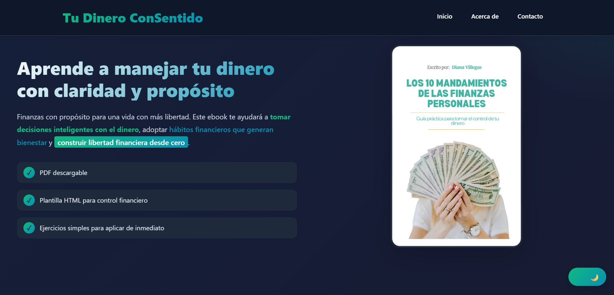
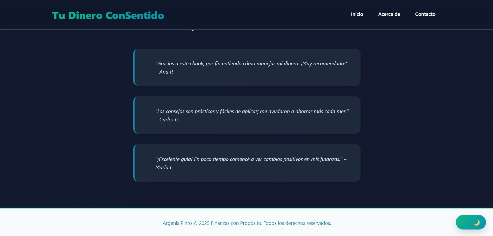

# Tu Dinero ConSentido – Landing Page

Landing page construida como ejercicio del Diplomado en Programación Fullstack, diseñada para promocionar y captar suscriptores interesados en un ebook gratuito de finanzas personales.

Incluye navegación anclada, diseño responsive, formulario y soporte para modo claro/oscuro.

---

## 🧪 Cómo clonar y ejecutar

1. Clona el repositorio:
```bash
git clone https://github.com/argenisjpinto/tarea-1-landing-page-ebook.git
```

2. Abrí el archivo en tu navegador:
```bash
cd tarea-1-landing-page-ebook
```
Luego haz doble clic en `index.html` o abrelo desde tu editor.

---

## 📸 Capturas

Hero principal


Sección Acerca


Formulario


Footer


---

## ✍️ Autor y créditos

Autor: Argenis Pinto

Curso: Diplomado en Programación Fullstack

Unidad: Módulo 1 - Unidad 1

Fecha: 2025

---

## 📚 Fuentes y recursos utilizados

Bibliografía:

Duckett, J. HTML & CSS: Design and Build Websites. John Wiley & Sons, 2011

Keith, J. HTML5 for Web Designers. 2ª ed. Nueva York, Estados Unidos: A Book Apart; 2010.

MDN Web Docs – HTML, CSS y validación de formularios

Recursos visuales:

Ilustraciones Diana Villegas

Íconos de emojis Unicode

Tipografía del sistema (Segoe UI, Roboto, Oxygen, sans-serif)