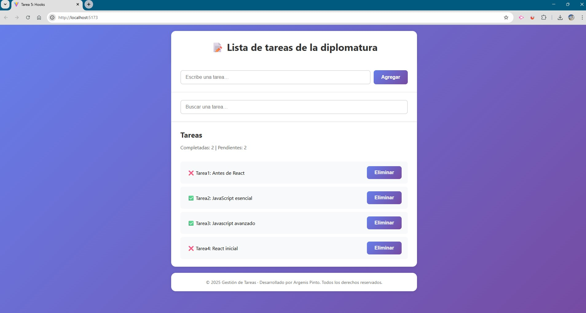
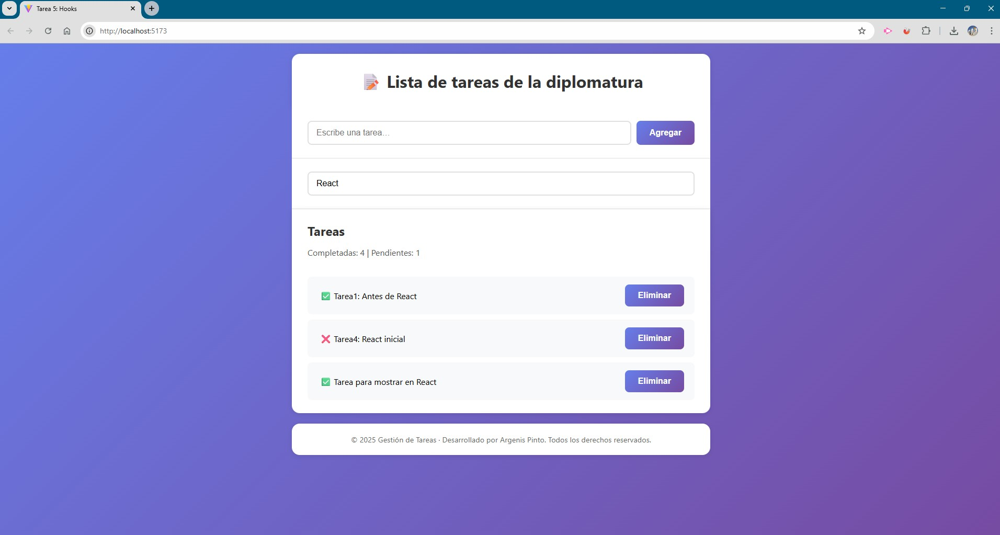

# 999201563 – React Inicial – Módulo 2 – Unidad 1 (Hooks)

## Estudiante
**Argenis Pinto**

## Descripción del proyecto
Proyecto desarrollado con **React** utilizando **Vite** como entorno de desarrollo.  
La aplicación consiste en una **lista de tareas** que permite agregar, buscar, completar y eliminar tareas, utilizando **React Hooks** para la gestión de estado, efectos secundarios, optimización y persistencia de datos.

El objetivo del proyecto es aplicar los conceptos vistos en el módulo de Hooks, implementando una solución funcional y organizada, alineada con las buenas prácticas de React.

### Conceptos aplicados
- `useState` para la gestión de estado
- `useEffect` para manejar efectos secundarios
- `useRef` para manipulación del DOM
- `useMemo` para optimizar cálculos derivados
- `useCallback` para optimizar funciones
- Creación de un **custom hook** (`useLocalStorage`) para persistir datos en `localStorage`

---

## Tecnologías utilizadas
- React
- Vite
- JavaScript (ES6+)
- CSS

---

## Estructura del proyecto
```
public/
src/
 ├── assets/
 │   ├── console.jpg
 │   └── interface.jpg
 ├── hooks/
 │   └── useLocalStorage.js
 ├── App.css
 ├── App.jsx
 ├── index.css
 └── main.jsx
index.html
README.md
```

---

## Funcionalidades principales
- Visualización de una lista de tareas precargadas.
- Agregar nuevas tareas.
- Buscar tareas por título.
- Marcar tareas como completadas o pendientes.
- Eliminar tareas.
- Mostrar el total de tareas completadas y pendientes.
- Persistencia automática de datos en `localStorage`.
- Enfoque automático del input al cargar la aplicación.

---

## Capturas de pantalla

### Interfaz principal


### Vista con tareas filtradas


---

## Créditos
- **Estudiante:** Argenis Pinto  
- **Curso:** React Inicial  
- **Módulo:** 2  
- **Unidad:** 1 – Hooks  

---

## Fuentes y referencias
- React Docs – useState  
  https://react.dev/reference/react/useState
- React Docs – useEffect  
  https://react.dev/reference/react/useEffect
- React Docs – useRef  
  https://react.dev/reference/react/useRef
- React Docs – useMemo  
  https://react.dev/reference/react/useMemo
- React Docs – Reusing Logic with Custom Hooks  
  https://react.dev/learn/reusing-logic-with-custom-hooks
- Documentación oficial de Vite  
  https://vitejs.dev/
