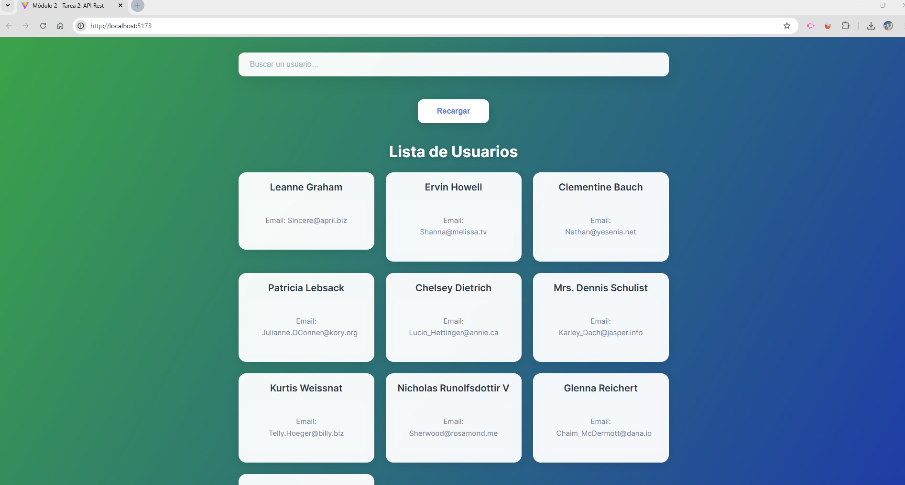
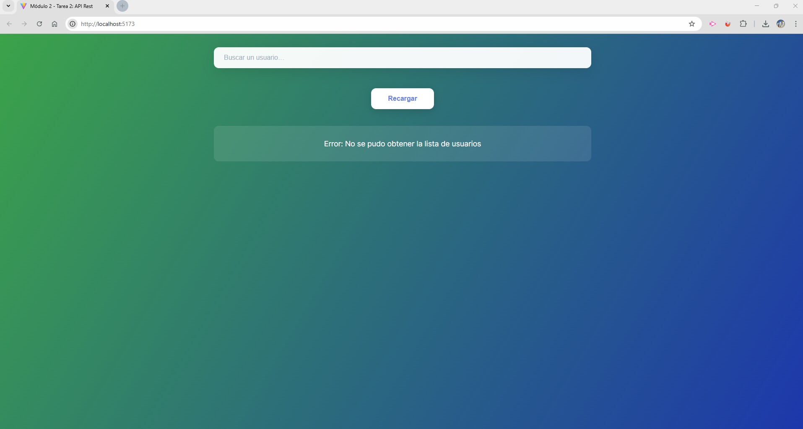
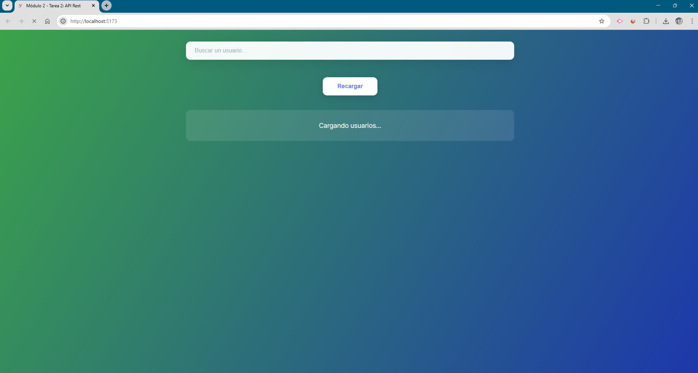

# 999201563 – React Inicial – Módulo 2 – Unidad 2 (API REST)

## Estudiante  
**Argenis Pinto**

---

## Descripción del proyecto
Proyecto desarrollado con **React** utilizando **Vite** como entorno de desarrollo.  
La aplicación consiste en una **lista de usuarios** obtenida desde una **API REST externa**, permitiendo visualizar, buscar y recargar los datos de manera dinámica.

El objetivo del proyecto es aplicar los conceptos vistos en el módulo de **consumo de APIs REST**, manejo de estados asíncronos y optimización del renderizado utilizando **React Hooks**, siguiendo buenas prácticas de arquitectura y experiencia de usuario.

La aplicación implementa estados de carga avanzados.

---

## Conceptos aplicados
- `useState` para la gestión de estados locales
- `useEffect` para el consumo de la API REST
- `useMemo` para optimizar el filtrado de usuarios
- `useCallback` para optimizar handlers
- Comunicación entre componentes mediante **props**
- Separación de responsabilidades entre componentes contenedores y de presentación
- Manejo de estados de carga (`loading`) y error (`error`)

---

## Tecnologías utilizadas
- React
- Vite
- JavaScript (ES6+)
- Fetch API
- CSS

---

## Estructura del proyecto
```
public/
src/
 ├── assets/
 │   ├── data.jpg
 │   ├── error.jpg
 │   └── loading.jpg
 │ 
 ├── components/
 │   ├── Usuarios.jsx
 │   ├── UsuarioCard.jsx
 │   └── UsuariosSkeleton.jsx
 │
 ├── styles/
 │   ├── Home.css
 │   └── Index.css
 │
 ├── views/
 │   └── Home.jsx
 │
 └── main.jsx
index.html
README.md

```

---

## Funcionalidades principales
- Obtención de usuarios desde una API REST externa.
- Visualización de la lista de usuarios.
- Búsqueda de usuarios por nombre en tiempo real.
- Recarga manual de datos sin recargar la página.
- Manejo de errores ante fallas en la petición a la API.
- Arquitectura modular y reutilizable de componentes.

---

## Capturas de pantalla

### Vista con datos de usuarios


### Vista de error de carga


### Vista de carga de usuarios


---

## API utilizada
- **JSONPlaceholder – Users**  
  https://jsonplaceholder.typicode.com/users

---

## Créditos
- **Estudiante:** Argenis Pinto  
- **Curso:** React Inicial  
- **Módulo:** 2  
- **Unidad:** 2 – API REST  

---

## Fuentes y referencias
- React Docs – useState  
  https://react.dev/reference/react/useState
- React Docs – useEffect  
  https://react.dev/reference/react/useEffect
- React Docs – useMemo  
  https://react.dev/reference/react/useMemo
- React Docs – useCallback  
  https://react.dev/reference/react/useCallback
- JSONPlaceholder – Fake Online REST API  
  https://jsonplaceholder.typicode.com/
- Documentación oficial de Vite  
  https://vitejs.dev/