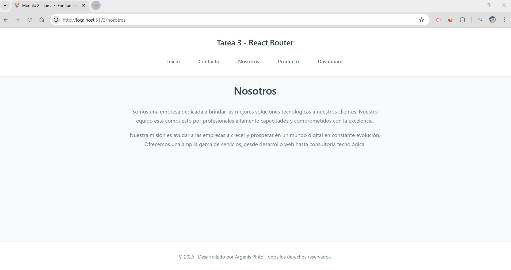
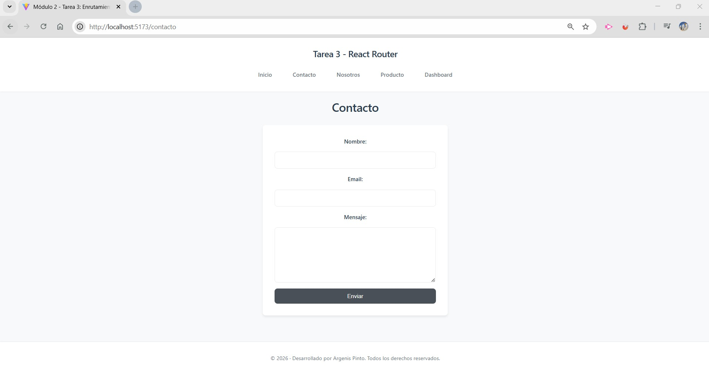
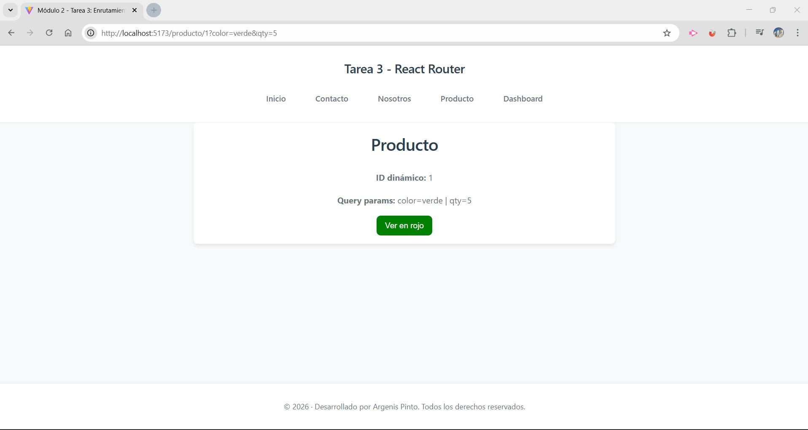
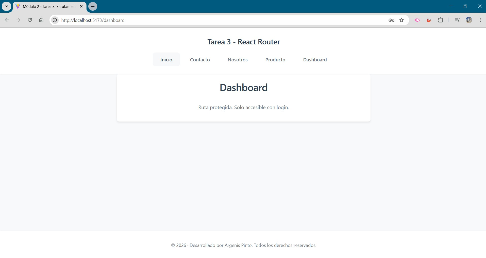
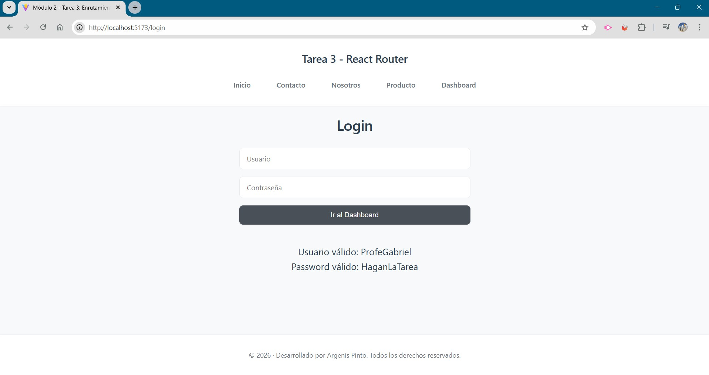

# Módulo 2 – Tarea 3: Enrutamiento con React Router

## Estudiante
**Argenis Pinto**

---

## Descripción del proyecto
Proyecto desarrollado con **React** y **Vite**, enfocado en la práctica de **enrutamiento** utilizando **React Router DOM**.

La aplicación implementa un **mini dashboard** con rutas públicas y protegidas, navegación declarativa y programática, rutas dinámicas, query params y un layout con navegación fija.

El objetivo principal es aplicar correctamente los conceptos de enrutamiento vistos en el **Módulo 2 – Unidad 3** de la diplomatura.

---

## Objetivos alcanzados
- Configuración del enrutamiento con `BrowserRouter`, `Routes` y `Route`
- Creación de páginas estáticas: **Inicio**, **Nosotros** y **Contacto**
- Navegación declarativa mediante `<Link>`
- Navegación programática utilizando `useNavigate`
- Ruta dinámica con `useParams`
- Manejo de query params con `useSearchParams`
- Implementación de un **layout** con rutas anidadas usando `<Outlet>`
- Simulación de una **ruta protegida** con redirección post-login utilizando `Navigate` y `useLocation`
- Manejo de estado para autenticación simulada

---

## Tecnologías utilizadas
- React
- Vite
- React Router DOM
- JavaScript (ES6+)
- CSS

---

## Estructura del proyecto
```
src/
 ├── assets/
 ├── components/
 │   ├── Header.jsx
 │   ├── Footer.jsx
 │   └── ProtectedRoute.jsx
 │
 ├── router/
 │   └── RouterApp.jsx
 │
 ├── styles/
 │   ├── index.css
 │   └── Inicio.css
 │
 ├── views/
 │   ├── Inicio.jsx
 │   ├── Nosotros.jsx
 │   ├── Contacto.jsx
 │   ├── Producto.jsx
 │   ├── Dashboard.jsx
 │   ├── Login.jsx
 │   ├── NotFound.jsx
 │   └── Layout.jsx
 │
 └── main.jsx
index.html
README.md
```

---

## Funcionalidades principales
- Navegación entre páginas sin recargar la aplicación
- Ruta dinámica `/producto/:id` mostrando el parámetro recibido
- Manejo de query params para modificar el comportamiento visual del componente
- Acceso restringido al Dashboard mediante autenticación simulada
- Redirección automática al login si el usuario no está autenticado
- Retorno automático a la ruta protegida luego del login
- Mensaje de confirmación en el formulario de contacto

---

## Instrucciones de instalación y ejecución
1. Clonar el repositorio:
```bash
git clone https://github.com/argenisjpinto/tareas-diplomatura-react-999201563.git
```

2. Instalar dependencias:
```bash
npm install
```

3. Ejecutar el proyecto en modo desarrollo:
```bash
npm run dev
```

---

## Credenciales de acceso (simulación)
- **Usuario:** ProfeGabriel  
- **Contraseña:** HaganLaTarea  

---

## Capturas de pantalla

### Página de inicio


### Página Nosotros


### Página de contacto


### Producto con ID dinámico (sin query params)



### Dashboard desprotegido (redirección a Login)


### Dashboard protegido (acceso permitido)


---

## Créditos
- **Estudiante:** Argenis Pinto
- **Curso:** React Inicial
- **Módulo:** 2
- **Unidad:** 3 – Enrutamiento

---

## Fuentes y referencias
- React Router – Documentación oficial  
  https://reactrouter.com/en/main
- React Router – useNavigate  
  https://reactrouter.com/en/main/hooks/use-navigate
- MDN Web Docs – URLSearchParams  
  https://developer.mozilla.org/en-US/docs/Web/API/URLSearchParams
- Documentación oficial de Vite  
  https://vitejs.dev/