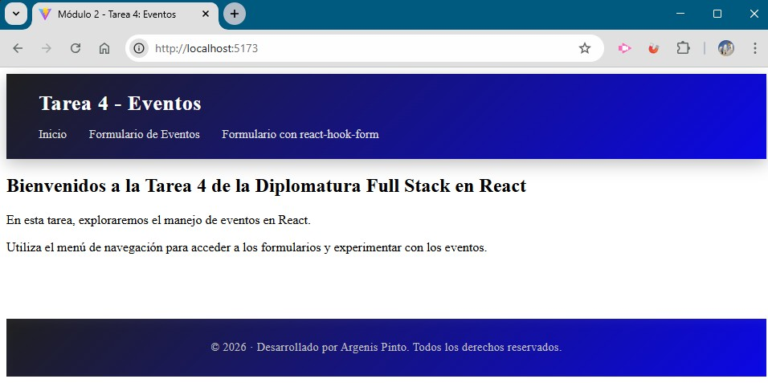
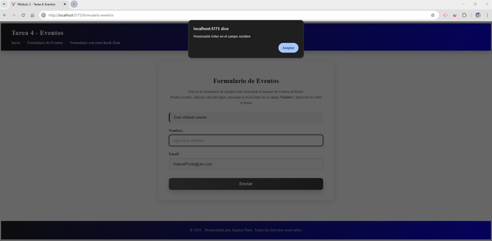
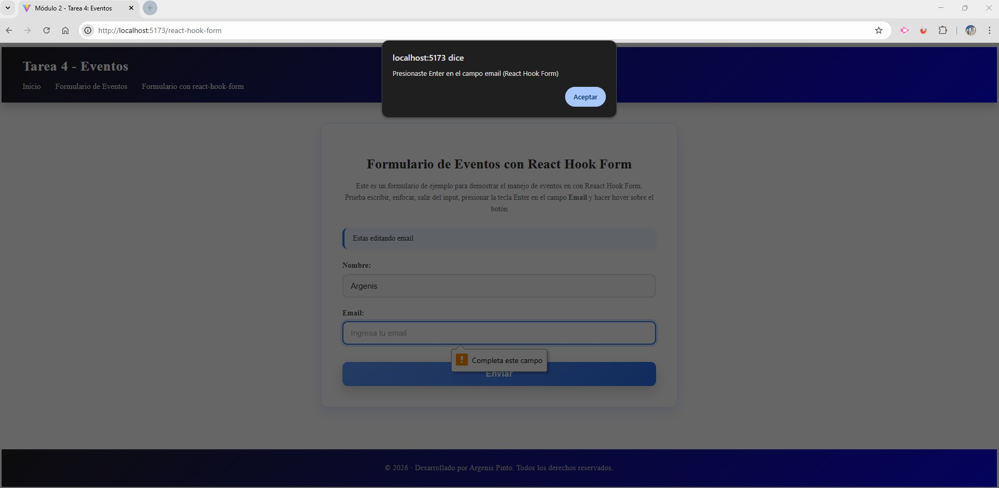

# Módulo 2 – Tarea 4: Eventos en React

## Estudiante
**Argenis Pinto**

---

## Descripción del proyecto
Proyecto desarrollado con **React** y **Vite**, enfocado en la práctica del **manejo de eventos en React**.

La aplicación implementa **dos formularios**:
- Un formulario utilizando **eventos nativos de React**.
- Un formulario alternativo utilizando **react-hook-form**, con el objetivo de comparar diferencias en código y comportamiento.

Se reutiliza **React Router DOM** (implementado en la tarea anterior) para organizar las vistas y la navegación.

---

## Objetivos alcanzados
- Creación de formularios controlados con React.
- Captura de eventos básicos:
  - `onChange`
  - `onFocus`
  - `onBlur`
- Control del envío del formulario mediante:
  - `onSubmit`
  - `preventDefault()`
- Implementación de interacciones adicionales:
  - Detección de la tecla **Enter** con `onKeyDown`
  - Cambio visual del botón con `onMouseEnter` y `onMouseLeave`
- Implementación opcional de un formulario con **react-hook-form**.
- Uso de un layout común con **Header** y **Footer**.

---

## Tecnologías utilizadas
- React
- Vite
- React Router DOM
- react-hook-form
- JavaScript (ES6+)
- CSS

---

## Estructura del proyecto
```
src/
 ├── assets/
 │   ├── comportamiento-formulario-de-eventos.jpg
 │   ├── comportamiento-react-hook-form.jpg
 │   ├── formulario-de-eventos.jpg
 │   ├── inicio.jpg
 │   └── react-hook-form.jpg
 │
 ├── components/
 │   ├── Header.jsx
 │   └── Footer.jsx
 │
 ├── router/
 │   └── RouterApp.jsx
 │
 ├── styles/
 │   ├── Home.css
 │   └── index.css
 │
 ├── views/
 │   ├── Home.jsx
 │   ├── FormularioEventos.jsx
 │   ├── FormularioReactHookForm.jsx
 │   ├── Layout.jsx
 │   └── NotFound.jsx
 │
 └── main.jsx
index.html
README.md
```

---

## Funcionalidades principales

### Formulario con eventos (React)
- Inputs controlados mediante `useState`.
- Registro de cambios con `onChange`.
- Mensajes visuales y en consola usando `onFocus` y `onBlur`.
- Detección de la tecla **Enter** en el campo nombre.
- Control del envío con `onSubmit` y `preventDefault()`.
- Feedback visual y alerta al enviar el formulario.
- Efecto hover en el botón mediante eventos del mouse.

### Formulario con react-hook-form (opcional)
- Uso de `useForm`, `register` y `handleSubmit`.
- Validación de campos requeridos.
- Manejo de errores.
- Limpieza del formulario con `reset()`.
- Implementación de eventos nativos combinados con react-hook-form.

---

## Instrucciones de instalación y ejecución
1. Clonar el repositorio:
```bash
git clone https://github.com/argenisjpinto/tareas-diplomatura-react-999201563.git
```

2. Instalar dependencias:
```bash
npm install
```

3. Ejecutar el proyecto en modo desarrollo:
```bash
npm run dev
```

---

## Capturas de pantalla

### Página de inicio


### Formulario con eventos


### Comportamiento del formulario de eventos


### Formulario con react-hook-form


### Comportamiento react-hook-form


---

## Créditos
- **Estudiante:** Argenis Pinto  
- **Curso:** React Inicial  
- **Módulo:** 2  
- **Unidad:** 4 – Eventos  

---

## Fuentes y referencias
- Documentación oficial de React  
  https://react.dev
- React Hook Form – Documentación oficial  
  https://react-hook-form.com
- MDN Web Docs – Eventos en JavaScript  
  https://developer.mozilla.org/es/docs/Web/API/Event
