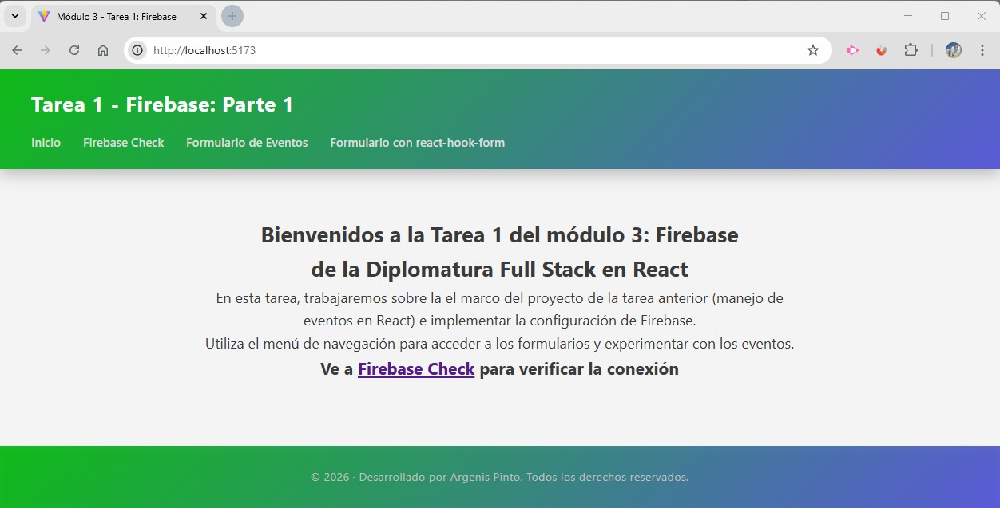
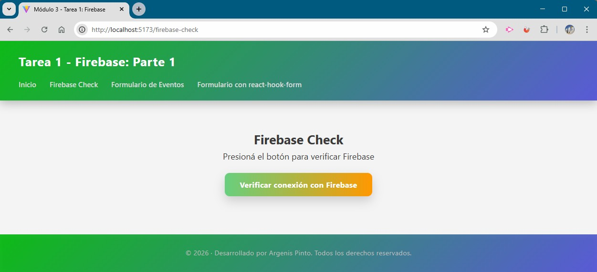
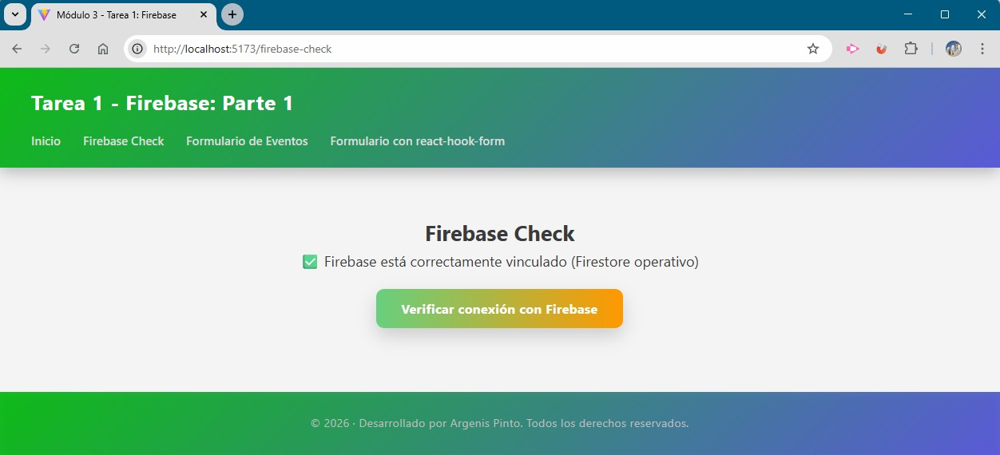

# Módulo 3 – Tarea 1: Firebase (Parte 1)

## Estudiante
**Argenis Pinto**

---

## Descripción del proyecto
Proyecto desarrollado con **React** y **Vite**, enfocado en la **integración inicial de Firebase** dentro de una aplicación frontend.

Esta tarea corresponde a la **Parte 1 de Firebase**, donde se realiza la configuración del SDK, el uso de variables de entorno y una **verificación desde el frontend** para confirmar que Firebase y Firestore están correctamente vinculados.

El proyecto reutiliza la base de la tarea anterior (Eventos) y se desarrolla en una **branch independiente**, manteniendo una estructura clara y ordenada.

---

## Objetivos alcanzados
- Creación de un proyecto web en **Firebase Console**.
- Vinculación de la aplicación React con Firebase.
- Instalación y configuración del SDK de Firebase.
- Uso de variables de entorno con Vite (`VITE_`).
- Inicialización de Firebase en un archivo de configuración independiente.
- Integración de **Firestore**.
- Verificación manual desde el frontend mediante un botón.
- Evidencia visual y en consola de la conexión exitosa.

---

## Tecnologías utilizadas
- React
- Vite
- React Router DOM
- Firebase
- Firestore
- JavaScript (ES6+)
- CSS

---

## Estructura del proyecto
```
src/
 ├── assets/
 │   ├── Firebase-check.jpg
 │   ├── Firebase-check-Verificado.jpg
 │   └── inicio.jpg
 │
 ├── components/
 │   ├── Header.jsx
 │   └── Footer.jsx
 │
 ├── config/
 │   └── firebase.js
 │
 ├── router/
 │   └── RouterApp.jsx
 │
 ├── styles/
 │   ├── Home.css
 │   └── index.css
 │
 ├── views/
 │   ├── Home.jsx
 │   ├── FirebaseCheck.jsx
 │   ├── FormularioEventos.jsx
 │   ├── FormularioReactHookForm.jsx
 │   ├── Layout.jsx
 │   └── NotFound.jsx
 │
 └── main.jsx
.env
.gitignore
index.html
README.md
```

---

## Verificación de Firebase desde el frontend
Se implementó una vista específica denominada **FirebaseCheck**, que incluye un botón para ejecutar una verificación manual.

### Funcionamiento
- Al presionar el botón **“Verificar conexión con Firebase”**:
  - Se intenta acceder a una colección de Firestore.
  - Si no ocurre ningún error, se confirma que Firebase y Firestore están correctamente inicializados.
  - Se muestra un mensaje de éxito en pantalla.
  - Se registra un mensaje en la consola del navegador.

Esta verificación confirma:
- Correcta configuración del SDK.
- Uso válido de variables de entorno.
- Conexión exitosa entre la aplicación React y Firebase.

---

## Variables de entorno
Las credenciales de Firebase se gestionan mediante un archivo `.env`, el cual **no se incluye en el repositorio**.

Ejemplo de variables utilizadas:

```
VITE_API_KEY=
VITE_AUTH_DOMAIN=
VITE_PROJECT_ID=
VITE_STORAGE_BUCKET=
VITE_MESSAGING_SENDER_ID=
VITE_APP_ID=
```

---

## Instrucciones de instalación y ejecución
1. Clonar el repositorio:
```bash
git clone https://github.com/argenisjpinto/tareas-diplomatura-react-999201563.git
```

2. Instalar dependencias:
```bash
npm install
```

3. Ejecutar el proyecto en modo desarrollo:
```bash
npm run dev
```

---

## Capturas de pantalla

### Página de inicio


### Vista Firebase Check


### Firebase verificado correctamente


---

## Créditos
- **Estudiante:** Argenis Pinto  
- **Curso:** React – Diplomatura Full Stack  
- **Módulo:** 3  
- **Unidad:** 1 – Firebase (Parte 1)  

---

## Fuentes y referencias
- Firebase – Documentación oficial  
  https://firebase.google.com/docs
- Firestore – Documentación oficial  
  https://firebase.google.com/docs/firestore
- Vite – Variables de entorno  
  https://vitejs.dev/guide/env-and-mode.html