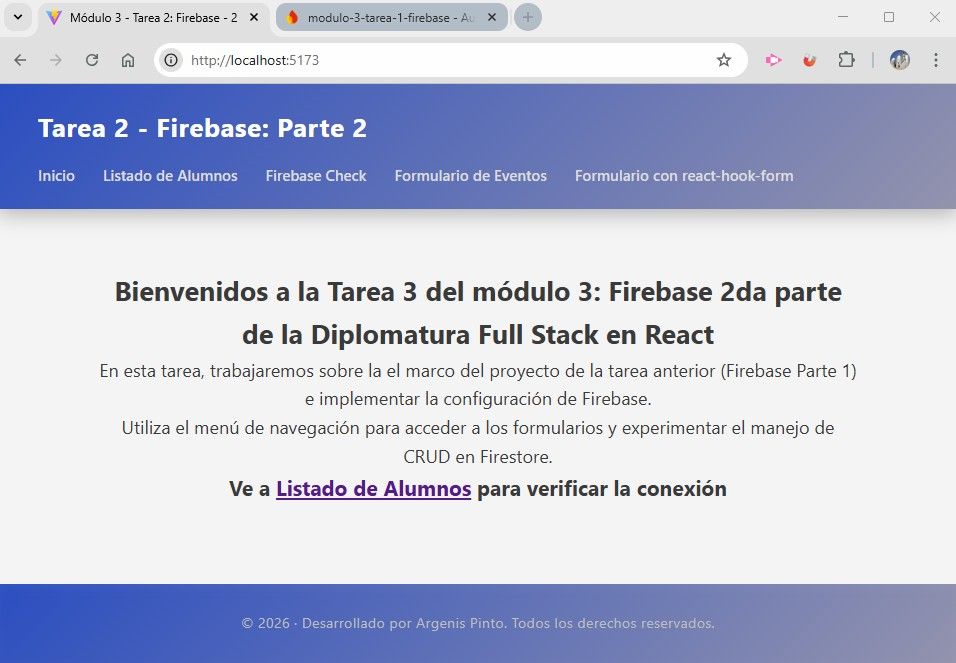
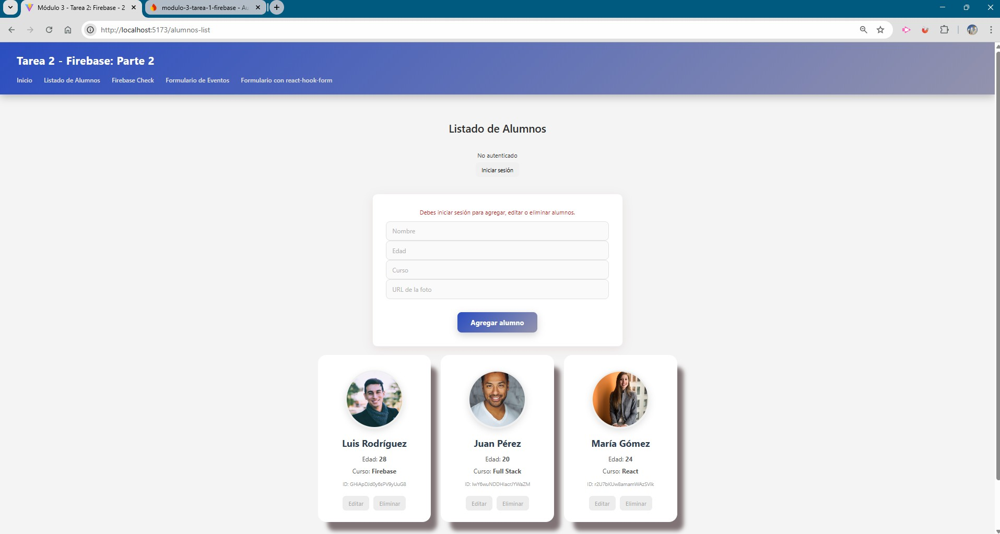

# Módulo 3 – Tarea 2: Firebase (Parte 2)

## Estudiante
**Argenis Pinto**

---

## Descripción del proyecto
Proyecto desarrollado con **React** y **Vite**, enfocado en la implementación de **Firebase Cloud Firestore** y **Firebase Authentication**.

La aplicación extiende la tarea anterior incorporando un **CRUD completo** sobre una colección en Firestore, junto con **reglas de seguridad** y **autenticación** para controlar las operaciones de escritura.

Se reutiliza **React Router DOM** para la navegación entre vistas.

---

## Objetivos de la consigna
- Implementar operaciones CRUD utilizando Firebase Cloud Firestore.
- Utilizar distintos métodos de acceso a datos:
  - `addDoc`
  - `setDoc` con ID definido
  - `setDoc` con `{ merge: true }`
  - `updateDoc`
  - `deleteDoc`
  - `getDocs`
  - `getDoc`
  - `onSnapshot`
- Configurar **reglas de seguridad** en Firestore.
- Integrar **Firebase Authentication** para restringir operaciones de escritura.
- Verificar el funcionamiento de las reglas de seguridad.

---

## Funcionalidades implementadas

### Lectura de datos
- Listado de alumnos obtenido desde Firestore.
- Sincronización en tiempo real mediante `onSnapshot`.
- Lectura puntual de documentos utilizando `getDoc`.

### Creación de datos
- Creación de documentos con ID automático mediante `addDoc`.
- Creación de documentos con ID definido utilizando `setDoc`.

### Actualización de datos
- Actualización directa de campos con `updateDoc`.
- Actualización parcial de documentos mediante `setDoc` con `{ merge: true }`.

### Eliminación de datos
- Eliminación de documentos utilizando `deleteDoc`.

---

## Autenticación y seguridad
- Autenticación implementada con **Firebase Authentication (Email/Password)**.
- Reglas de seguridad configuradas para:
  - Permitir lectura pública.
  - Permitir creación, modificación y eliminación solo a usuarios autenticados.
- Verificación del funcionamiento de las reglas:
  - Operaciones de escritura bloqueadas sin autenticación.
  - Operaciones de escritura habilitadas con sesión iniciada.

---

## Capturas de pantalla

Las siguientes imágenes documentan el funcionamiento de la aplicación y los puntos solicitados en la consigna:

### Inicio


### Sesión cerrada


### Formulario con sesión iniciada


### Edición de un alumno


### Configuración de la base de datos en Firestore


### Configuración Email/Password en la base de datos en Firestore


---

## Estructura del proyecto

```
src/
│
├── assets/
│   ├── auth-email-password.jpg
│   ├── editing-student.jpg
│   ├── firestore-database.jpg
│   ├── form-login.jpg
│   ├── form-logout.jpg
│   └── home.jpg
│
├── components/
│   ├── Footer.jsx
│   └── Header.jsx
│
├── config/
│   └── firebase.js
│
├── services/
│   └──apiFirebase.js
│
├── router/
│   └── RouterApp.jsx
│
├── styles/
│   ├── Home.css
│   └── index.css
│
├── views/
│   ├── FirebaseCheck.jsx
│   ├── FormularioEventos.jsx
│   ├── FormularioReactHookForm.jsx
│   ├── Home.jsx
│   ├── Layout.jsx
│   ├── ListadoAlumnos.jsx
│   └── NotFound.jsx
│
├── main.jsx
│
├── .env
├── .gitignore
└── eslint.config.js
```

---

## Tecnologías utilizadas
- React
- Vite
- Firebase Cloud Firestore
- Firebase Authentication
- React Router DOM

---

## Observaciones
Este proyecto cumple con todos los puntos solicitados en la consigna de **Firebase Parte 2**, demostrando el uso de diferentes métodos de acceso a datos, reglas de seguridad y autenticación.