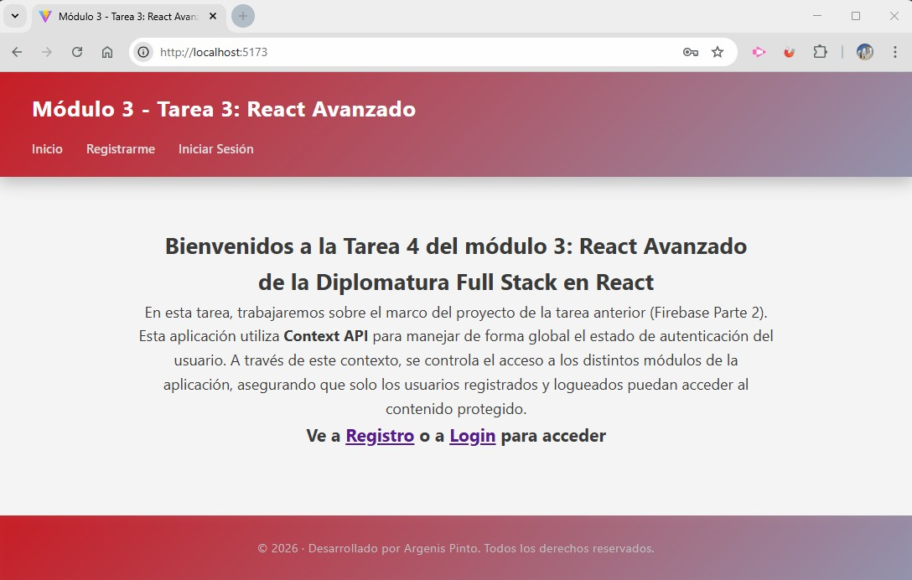
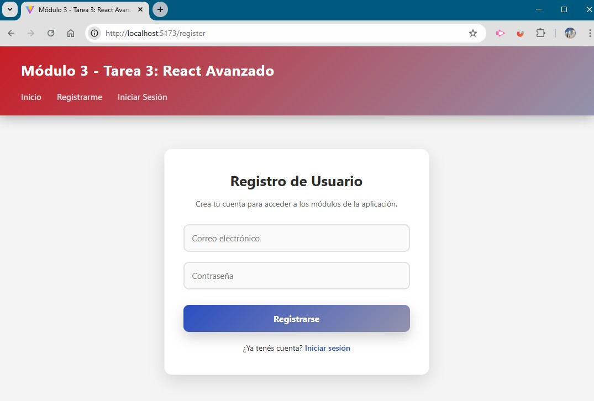
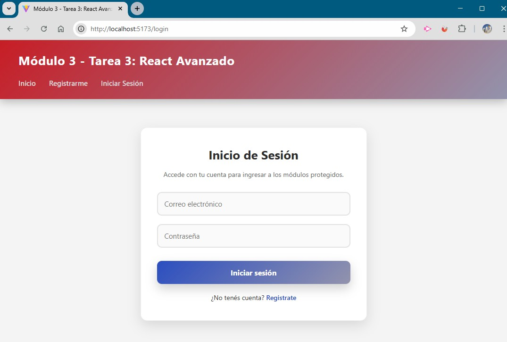
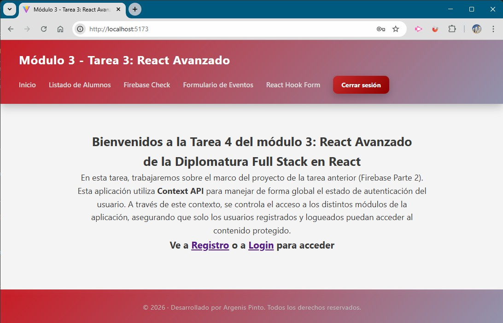
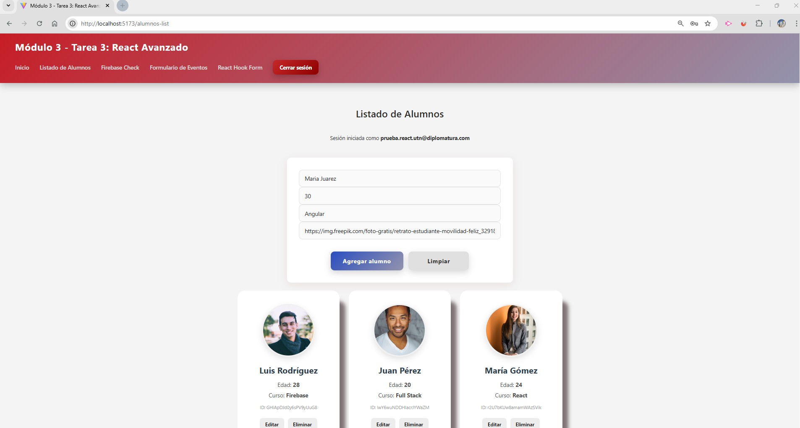
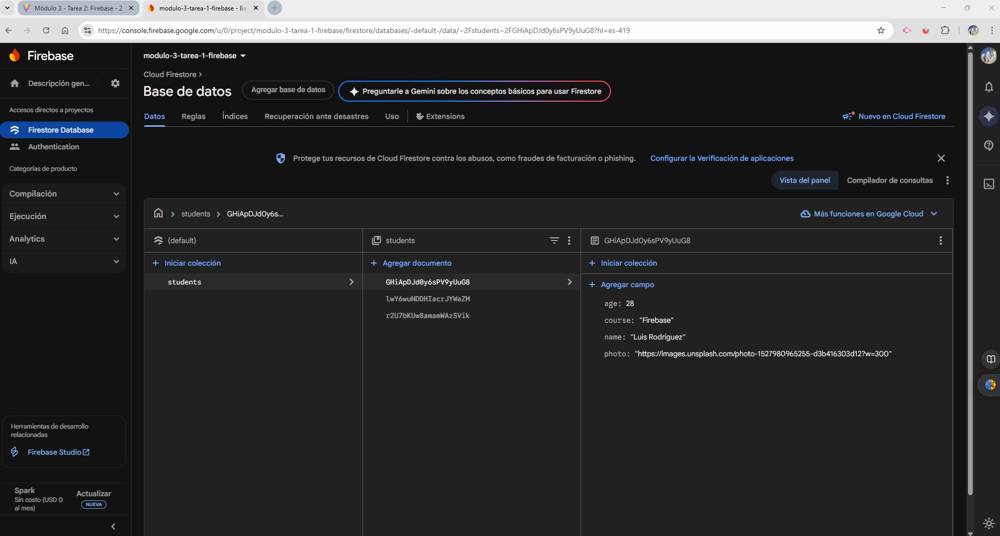
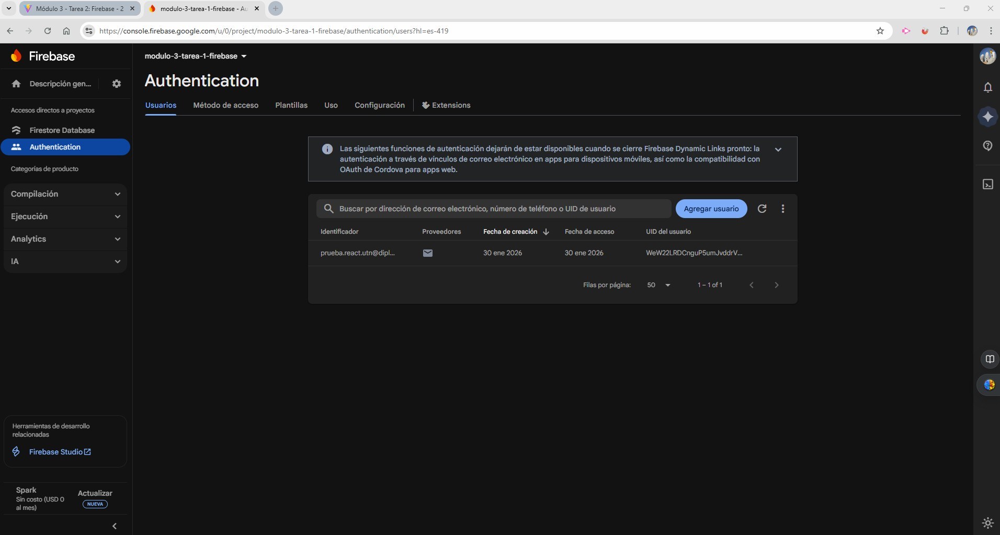

# Módulo 3 – Tarea 3: React Avanzado

## Estudiante
**Argenis Pinto**

---

## Descripción del proyecto
Proyecto desarrollado con **React** y **Vite**, que extiende la base de la tarea anterior (**Firebase – Parte 2**) incorporando conceptos de **React Avanzado**, principalmente el uso de **Context API** para el manejo global del estado de autenticación y la **protección de rutas**.

La aplicación implementa un sistema de autenticación con **Firebase Authentication**, controlando el acceso a los distintos módulos mediante rutas protegidas y renderizado condicional de la interfaz.

---

## Objetivos de la consigna
- Implementar **Context API** para manejar estado global.
- Centralizar la lógica de autenticación en un **AuthContext**.
- Proteger rutas privadas mediante un componente `ProtectedRoute`.
- Controlar el acceso a los módulos según el estado de autenticación.
- Integrar Firebase Authentication (Email/Password).
- Reutilizar la estructura del proyecto anterior con Firebase.

---

## Funcionalidades implementadas

### Autenticación
- Registro de usuarios con Email y Password.
- Inicio de sesión mediante Firebase Authentication.
- Persistencia de sesión utilizando `onAuthStateChanged`.
- Estado de autenticación global accesible desde cualquier componente.

### Context API
- Creación de `AuthContext` para gestionar:
  - Usuario autenticado
  - Registro
  - Login
  - Logout

### Rutas protegidas
- Implementación de `ProtectedRoute`.
- Restricción de acceso a:
  - Listado de Alumnos
  - Firebase Check
  - Formularios
- Redirección automática a `/login` cuando el usuario no está autenticado.

### Interfaz dinámica
- Menú de navegación que se adapta según el estado del usuario.
- Visualización del email del usuario autenticado.
- Bloqueo de acciones CRUD si no hay sesión iniciada.

---

## Firebase y seguridad

### Firestore
- CRUD completo sobre la colección `students`.
- Lectura en tiempo real mediante `onSnapshot`.

### Reglas de seguridad
- Lectura pública de la colección `students`.
- Escritura permitida únicamente a usuarios autenticados.

---

## Capturas de pantalla

Las siguientes imágenes documentan el funcionamiento de la aplicación y los puntos solicitados en la consigna:

### Vista Home sin sesión iniciada


### Registro de usuario


### Inicio de sesión


### Vista Home con usuario autenticado


### Listado de alumnos con sesión activa


### Verificación de conexión a Firebase


### Usuario y password en  Firebase


*(Las imágenes se encuentran en la carpeta `src/assets`)*

---

## Estructura del proyecto

```
src/
│
├── assets/
│   ├── auth-email-password.jpg
│   ├── firestore-database.jpg
│   ├── home-login.jpg
│   ├── home-logout.jpg
│   ├── login-page.jpg
│   ├── register-page.jpg
│   └── student-list-login.jpg
│
├── components/
│   ├── Footer.jsx
│   ├── Header.jsx
│   └── ProtectedRoute.jsx
│
├── config/
│   └── firebase.js
│
├── context/
│   └── AuthContext.jsx
│
├── router/
│   └── RouterApp.jsx
│
├── services/
│   └── apiFirebase.js
│
├── styles/
│   ├── Home.css
│   └── index.css
│
├── views/
│   ├── FirebaseCheck.jsx
│   ├── FormularioEventos.jsx
│   ├── FormularioReactHookForm.jsx
│   ├── Home.jsx
│   ├── Layout.jsx
│   ├── ListadoAlumnos.jsx
│   ├── Login.jsx
│   ├── Register.jsx
│   └── NotFound.jsx
│
├── main.jsx
│
├── .env
├── .gitignore
└── eslint.config.js
```

---

## Tecnologías utilizadas
- React
- Vite
- Firebase Authentication
- Firebase Cloud Firestore
- React Router DOM
- Context API