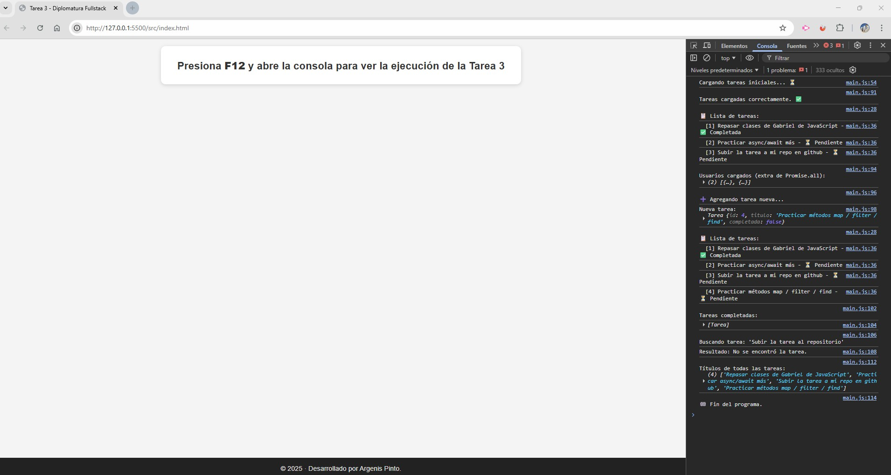
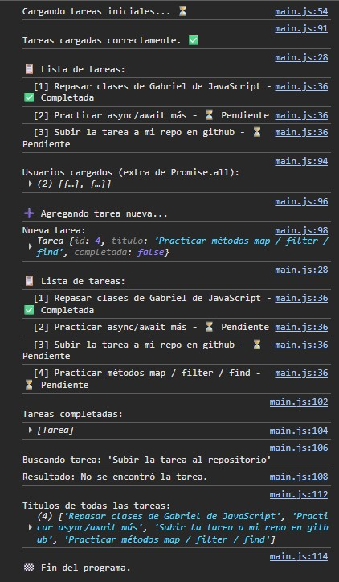

# Tarea 3 – JavaScript Avanzado  

Gestor de Tareas (con clases, arrays y asincronía)

Este proyecto forma parte del módulo de **JavaScript Avanzado** del Diplomado Fullstack.  
La idea fue construir un pequeño sistema de tareas que funcione desde la **consola**, aplicando:

- Clases y métodos  
- Manejo de arrays con `map`, `filter`, `find`, `forEach`  
- Promesas con `setTimeout`  
- `async/await`  
- Uso de `Promise.all` (práctica adicional)

Aunque el proyecto puede correr únicamente con JavaScript, decidí incorporar un `index.html` para ejecutar el archivo principal `main.js` de manera sencilla desde el navegador.

---

## 📁 Estructura del proyecto

```
tarea3-javascript-avanzado/
│
├── index.html               # Archivo mínimo para ejecutar el script
│
├── App/
│   └── main.js              # Lógica completa del gestor de tareas
│
├── assets/
│   ├── console.jpg
│   └── interface.jpg
│
└── README.md
```

---

## 🚀 Cómo ejecutarlo

### Opción 1 — Abrir en el navegador
1. Abrir **index.html**  
2. Presionar **F12** para abrir la consola  
3. Ver la ejecución paso a paso del programa

### Opción 2 — Ejecutar con Node (opcional)
```bash
node App/main.js
```

---

## 🧠 ¿Qué hace el programa?

- Carga tareas iniciales de forma asíncrona  
- Permite agregar tareas nuevas  
- Lista todas las tareas  
- Filtra tareas completadas  
- Busca una tarea por título  
- Genera un array de títulos con `map`  
- Usa `Promise.all` para simular cargas simultáneas  

Todo se visualiza en consola.

---

## 🖼️ Capturas

Interface 


Console  


---

## 👨‍💻 Autor

**Argenis Pinto**  
Diplomado en Programación Fullstack
**Unidad:** Módulo 1 – JavaScript Avanzado
**Fecha:** 2025 

---

## 📚 Fuentes y recursos utilizados

**Bibliografía:**
- Freeman, E. y Robson, E. Head First JavaScript Programming. O’Reilly Media, 2014.
- Flanagan, D. *JavaScript: The Definitive Guide.* O’Reilly Media, 2020  
- MDN Web Docs – HTML, CSS, JavaScript y validación de formularios  

---

**Recursos visuales:**
- Emojis Unicode

---
