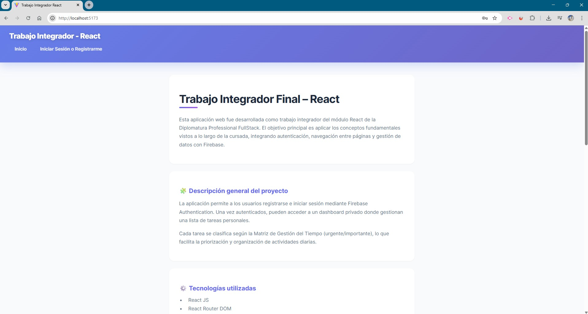
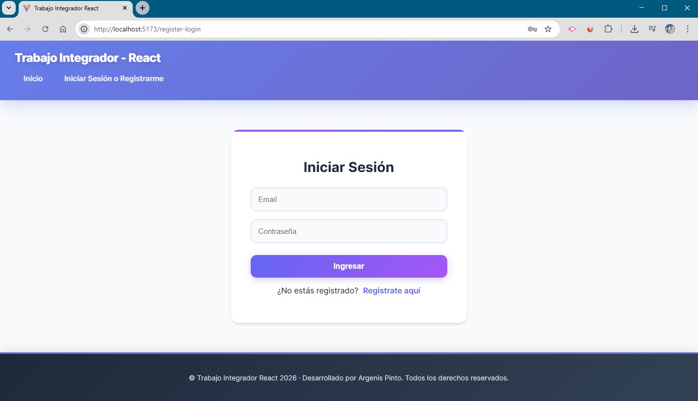
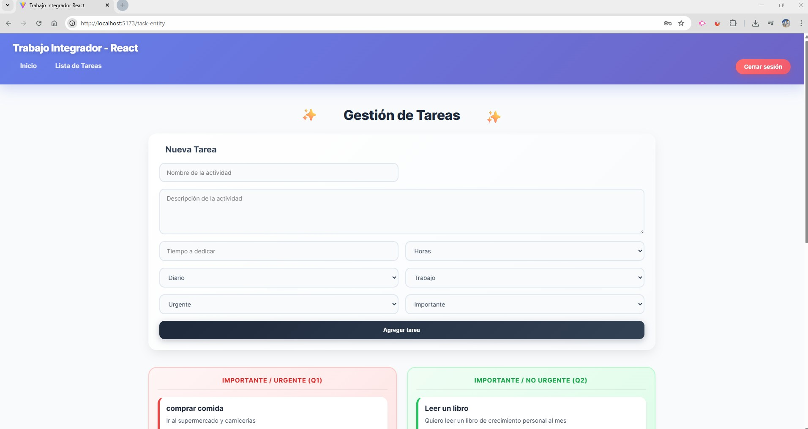
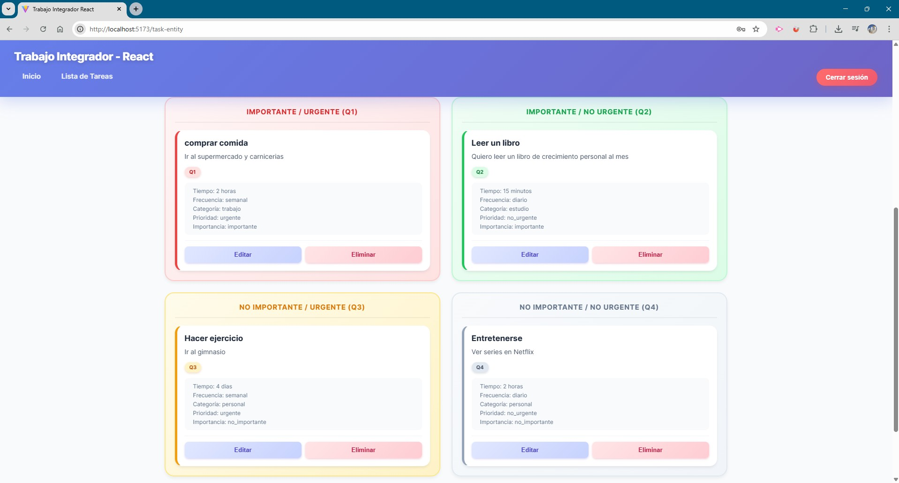
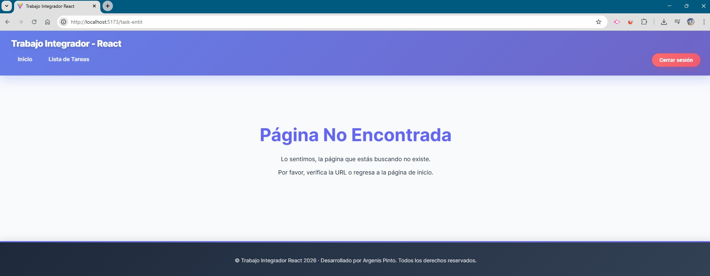
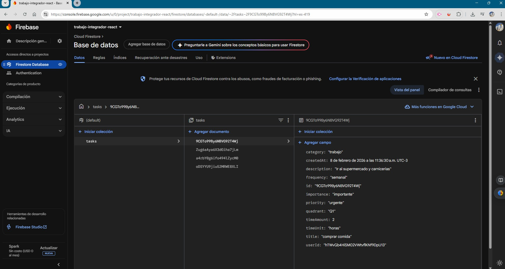

# Trabajo Integrador – React JS

## 👨‍🎓 Estudiante
**Argenis Pinto**

---

## 📌 Descripción del proyecto

Este proyecto corresponde al **Trabajo Integrador** del módulo de **React JS**.  
El objetivo principal es consolidar los conceptos fundamentales vistos durante la cursada mediante el desarrollo de una aplicación web completa que incluye:

- Autenticación de usuarios
- Navegación entre páginas
- Manejo de estado global
- Persistencia de datos con Firebase
- Estilos realizados con CSS nativo

La aplicación permite a los usuarios gestionar una **lista de tareas personales**, clasificadas según la **Matriz de Gestión del Tiempo (Q1–Q4)**, facilitando la priorización de actividades.

---

## 🎯 Objetivos alcanzados

- Implementación de **Login y Registro** utilizando Firebase Authentication.
- Manejo global del estado de sesión mediante **AuthContext**.
- Protección de rutas privadas con React Router DOM.
- Desarrollo de un **CRUD completo** sobre la entidad *Tareas*.
- Persistencia de datos en **Firebase Firestore**.
- Clasificación automática de tareas según urgencia e importancia.
- Representación visual de la matriz de gestión del tiempo.
- Estilos aplicados exclusivamente con **CSS nativo**.

---

## 🧩 Funcionalidades principales

### 🔐 Autenticación
- Registro de usuarios con email y contraseña.
- Inicio y cierre de sesión.
- Redirección automática al dashboard luego de autenticarse.

### ✅ Gestión de tareas
- Crear nuevas tareas.
- Editar tareas existentes.
- Eliminar tareas.
- Clasificar tareas por:
  - Tiempo a dedicar
  - Frecuencia
  - Categoría
  - Prioridad
  - Importancia
- Visualización de tareas en una matriz Q1–Q4.

### 🛡️ Seguridad
- Reglas de seguridad en Firestore basadas en el usuario autenticado.
- Cada usuario solo puede acceder a sus propias tareas.

---

## Capturas de pantalla

Las siguientes imágenes documentan el funcionamiento de la aplicación y los puntos solicitados en la consigna:

### Vista Home sin sesión iniciada


### Registro de usuario


### Inicio de sesión


### Listado de tareas con sesión activa


### Vista de Matriz de tareas cargadas


### Pagina no encontrada


### Colección en la base de datos de Firestore


*(Las imágenes se encuentran en la carpeta `src/assets`)*
---

## 🗂️ Estructura del proyecto

```
src/
├── assets/
│   ├── firestore-collection.jpg
│   ├── home.jpg
│   ├── login.jpg
│   ├── not-found.jpg
│   ├── register.jpg
│   ├── task-lists-form.jpg
│   └── task-lists-matrix.jpg
├── components/
│   ├── Header.jsx
│   ├── Footer.jsx
│   ├── TaskCard.jsx
│   └── TaskForm.jsx
├── views/
│   ├── Home.jsx
│   ├── RegisterLogin.jsx
│   ├── TasksEntity.jsx
│   └── NotFound.jsx
├── context/
│   └── AuthContext.jsx
├── services/
│   └── apiFirebase.js
├── config/
│   └── Firebase.js
├── styles/
│   ├── Home.css
│   └── Tasks.css
├── router/
│   └── RouterApp.jsx
└── main.jsx
```

---

## ⚙️ Tecnologías utilizadas

- **React JS**
- **React Router DOM**
- **Firebase Authentication**
- **Firebase Firestore**
- **Context API**
- **CSS nativo**
- **Vite**

---

## 🔧 Instalación y ejecución local

1. Clonar el repositorio:
   ```bash
   git clone <url-del-repositorio>
   ```

2. Instalar dependencias:
   ```bash
   npm install
   ```

3. Crear un archivo `.env` con las credenciales de Firebase:
   ```env
   VITE_API_KEY=
   VITE_AUTH_DOMAIN=
   VITE_PROJECT_ID=
   VITE_STORAGE_BUCKET=
   VITE_MESSAGING_SENDER_ID=
   VITE_APP_ID=
   ```

4. Ejecutar el proyecto:
   ```bash
   npm run dev
   ```

---

## 🧠 Decisiones técnicas relevantes

- Uso de **AuthContext** para evitar prop drilling y centralizar la autenticación.
- Separación de componentes según responsabilidad.
- Renderizado directo de tareas por cuadrante para reforzar el concepto de la matriz.
- Validaciones nativas de HTML para inputs numéricos.
- Eliminación de código no utilizado para mantener el proyecto limpio y mantenible.

---

## ⚠️ Dificultades encontradas y soluciones

- **Reglas de seguridad en Firestore**:  
  Se resolvió separando correctamente las reglas de lectura y escritura según el tipo de operación.
- **Manejo del estado de edición**:  
  Se implementó controlando la tarea seleccionada desde el componente contenedor.

---

## 📚 Bibliografía

- Banks, A. & Porcello, E. (2016). *Learning React*. O’Reilly Media.
- Flanagan, D. (2020). *JavaScript: The Definitive Guide*. O’Reilly Media.
- React Docs – https://react.dev
- Firebase Docs – https://firebase.google.com/docs

---